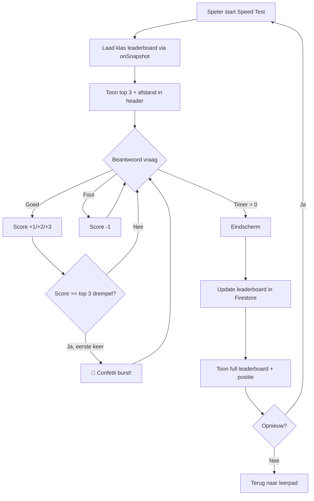

# Speedgame Introductie — Competitief Leaderboard Plan

## Doel
De §8.1 Speed Test ("Termen Tikkie") uitbreiden met een **live klassenleaderboard** dat:
- De top 3 scores van klasgenoten toont **tijdens het spelen**
- Visueel beloont met **confetti** als je de top 3 binnendringt
- Na afloop de **hoogste persoonlijke score** bewaart
- Herhaald spelen stimuleert om de hoogste score te behalen

---

## Huidige Situatie

| Onderdeel | Status |
|-----------|--------|
| Speed test engine | ✅ Werkt (5 min, punten per antwoord) |
| Pass/fail gating | ✅ 35 punten = §8.1 ontgrendeld |
| Score opslag | ✅ `bestScore` + `lastScore` per user |
| Leaderboard | ✅ GEÏMPLEMENTEERD (`leaderboardService.ts`) |
| Confetti | ✅ GEÏMPLEMENTEERD (`canvas-confetti`) |
| Retry na afloop | ✅ Quick restart + competitief aspect |
| Power meter | ✅ GEÏMPLEMENTEERD |
| Boss rounds | ✅ GEÏMPLEMENTEERD (elke 60s) |
| Combo banners | ✅ GEÏMPLEMENTEERD (streak 3/5/7) |
| Mission cards | ✅ GEÏMPLEMENTEERD (3 mini-doelen) |
| Rival indicator | ✅ GEÏMPLEMENTEERD |

---

## Architectuur

### 1. Firestore Leaderboard Collection

```
/leaderboard/speedtest_8_1/scores/{uid}
```

| Veld | Type | Beschrijving |
|------|------|-------------|
| `uid` | string | User ID |
| `firstName` | string | Voornaam (voor display) |
| `classId` | string \| null | Klas-ID (voor filtering) |
| `bestScore` | number | Hoogste score ooit |
| `lastScore` | number | Score van laatste poging |
| `attempts` | number | Totaal aantal pogingen |
| `bestScoreAt` | timestamp | Wanneer beste score behaald |
| `updatedAt` | timestamp | Laatste update |

> [!IMPORTANT]
> Door `classId` op te slaan kunnen we filteren op klasgenoten. De `classId` komt al uit het bestaande `UserProfile`.

### 2. Leaderboard Service

```typescript
// services/leaderboardService.ts

// Lees top N scores voor een specifieke klas
getClassLeaderboard(classId: string, limit: number): Promise<LeaderboardEntry[]>

// Update score na een speed test run
updateLeaderboardScore(uid: string, profile: UserProfile, score: number): Promise<void>

// Realtime listener voor live updates tijdens het spelen
subscribeClassLeaderboard(classId: string, limit: number, callback): Unsubscribe
```

> [!TIP]
> We gebruiken `onSnapshot` met een Firestore query gesorteerd op `bestScore` DESC, gelimiteerd tot 10 entries. Dit geeft **realtime updates** wanneer een klasgenoot een nieuwe highscore zet — zelfs terwijl jij speelt.

### 3. Firestore Query

```typescript
query(
  collection(db, 'leaderboard', 'speedtest_8_1', 'scores'),
  where('classId', '==', classId),
  orderBy('bestScore', 'desc'),
  limit(10)
)
```

> [!NOTE]
> Vereist een Firestore **composite index** op `classId` + `bestScore`. Dit wordt automatisch aangemaakt door Firestore wanneer de query voor het eerst wordt uitgevoerd (link in console-error).

---

## UI Wijzigingen

### A. Tijdens het spelen (header uitbreiding)

```
┌─────────────────────────────────────────────────┐
│  4:32   Score: 28 / 35   🔥 7                   │
│  ▓▓▓▓▓▓▓▓▓▓▓▓▓▓▓▓▓▓▓░░░░░░░░░░  (score bar)   │
├─────────────────────────────────────────────────┤
│  🏆 TOP 3 KLAS                                  │
│  1. Sem ......... 52 pts                         │
│  2. Noa ......... 47 pts                         │
│  3. Lisa ........ 41 pts  ← 13 punten nodig!    │
├─────────────────────────────────────────────────┤
│              n + n = ?                           │
│         [2n]  [n²]  [n+2]  [nn]                 │
└─────────────────────────────────────────────────┘
```

#### Elementen:
- **Top 3 Paneel**: Compact, altijd zichtbaar onder de score bar
- **Afstand-indicator**: "← X punten nodig!" bij de laagste top-3 score
- **Highlight**: Als de speler zelf in de top 3 staat → zijn naam **glow/highlight**
- **Live update**: Scores updaten realtime via `onSnapshot`

### B. Confetti bij top 3 entry

```
Trigger: wanneer speler.score >= top3[2].bestScore
         EN speler was NIET al in top 3

Visueel:
- Canvas-based confetti burst (lightweight, ~2KB lib of eigen CSS)
- Kort flash-banner: "🎉 Je staat in de TOP 3!"
- Banner verdwijnt na 2 seconden (mag niet afleiden)
- Maximaal 1x per run triggeren (voorkomen herhaald vuren bij elk punt)
```

> [!TIP]
> Gebruik `canvas-confetti` (npm, ~3KB gzipped) of een eigen CSS keyframe animatie met ~30 particles. Canvas-confetti is betrouwbaarder en mooier.

### C. Eindscherm (na 5 minuten)

```
┌─────────────────────────────────────────────────┐
│                   🎉 / 💪                        │
│             Tijd is om!                          │
│                                                  │
│            42 punten                             │
│     18 goed, 3 fout                              │
│                                                  │
│     🏆 JOUW POSITIE: #2 van 28 leerlingen       │
│                                                  │
│  ┌─────────────────────────────────┐             │
│  │ 1. Sem .............. 52 pts    │             │
│  │ 2. JIJ ............. 42 pts ⭐ │             │
│  │ 3. Lisa ............ 41 pts    │             │
│  │ 4. Noa ............. 38 pts    │             │
│  │ 5. Tim ............. 35 pts    │             │
│  └─────────────────────────────────┘             │
│                                                  │
│     Persoonlijk record: 42 pts (NIEUW!)          │
│                                                  │
│    [ Opnieuw proberen ]  [ Terug ]               │
└─────────────────────────────────────────────────┘
```

#### Elementen:
- **Positie in de klas** prominent weergegeven
- **Top 5** (of top 10) leaderboard met jouw positie gehighlight
- **Persoonlijk record** badge als je je eigen score hebt verbeterd
- **"Opnieuw proberen"** knop altijd beschikbaar (geen limiet)
- **"NIEUW!"** label bij persoonlijk record als het verbeterd is

### D. Ready-scherm (voor het starten)

```
┌─────────────────────────────────────────────────┐
│           Termen Tikkie                          │
│        Snelheidstest — 5 minuten                 │
│                                                  │
│   🏆 KLAS LEADERBOARD                           │
│   1. Sem .............. 52 pts                   │
│   2. Lisa ............. 41 pts                   │
│   3. Tim .............. 35 pts                   │
│                                                  │
│   Jouw record: 28 pts (#6)                       │
│                                                  │
│            [ START! ]                             │
└─────────────────────────────────────────────────┘
```

---

## Implementatiestappen

### Stap 1: Leaderboard Service (Firestore)
- Maak `services/leaderboardService.ts`
- Functies: `getClassLeaderboard`, `updateLeaderboardScore`, `subscribeClassLeaderboard`
- Write: na elke speed test run → update leaderboard entry met max(bestaand, nieuw)
- Read: realtime subscription met `onSnapshot`

### Stap 2: Confetti Utility
- Installeer `canvas-confetti` als lightweight dependency
- OF bouw een eigen CSS confetti component (~30 divs met keyframe animaties)
- Wrapper functie: `triggerConfetti()` die een burst doet vanuit het midden

### Stap 3: Leaderboard Component
- `components/ClassLeaderboard.tsx` — herbruikbaar component
- Props: `entries`, `currentUid`, `compact` (voor tijdens spelen) vs `full` (voor eindscherm)
- Compact mode: alleen top 3, 1 regel per entry
- Full mode: top 5-10, highlight eigen positie, toon rang

### Stap 4: SpeedTest8_1.tsx Aanpassingen
- **Ready screen**: Laad leaderboard, toon top 3 + eigen positie
- **Playing screen**: Subscribe op leaderboard, toon compact top 3
  - Bereken "afstand tot top 3" live
  - Trigger confetti als speler top 3 binnendringt
- **Ended screen**: Toon full leaderboard, update score in Firestore
  - Badge "NIEUW!" als persoonlijk record verbeterd
  - Toon klas-positie

### Stap 5: Score Update Flow
```
Speler beëindigt run (timer = 0)
  ↓
logSpeedTestRun() → bestaande flow (intact)
  ↓
updateLeaderboardScore(uid, profile, score)
  ↓
  Als score > bestaande bestScore:
    → Update Firestore leaderboard entry
    → Andere spelers zien de update via onSnapshot
```

---

## Technische Overwegingen

### Realtime vs Polling
| Aanpak | Voordelen | Nadelen |
|--------|-----------|---------|
| `onSnapshot` (realtime) | Instant updates, geen polling overhead | Firestore reads per update |
| Polling (elke 10s) | Minder reads | Vertraagde updates |

**Keuze**: `onSnapshot` — het is een klas van ~30 leerlingen, de reads zijn minimaal en het effect is veel beter voor de competitie.

### Firestore Reads Budget
- Per speler per run: ~1 snapshot listener (leest initieel + delta's)
- Met 30 leerlingen die tegelijk spelen: ~30 listeners × ~30 updates = ~900 reads
- Dit valt ruim binnen de gratis Firestore quota (~50K reads/dag)

### Privacy
- Alleen **voornaam** tonen (geen achternaam, geen leerlingnummer)
- Scores zijn alleen zichtbaar voor klasgenoten (gefilterd op `classId`)

### Anti-cheat
- Score wordt server-side berekend (al bestaand in de engine)
- Timestamps worden opgeslagen per run
- Geen client-side score manipulatie mogelijk (score state is in React state, niet in localStorage)

> [!WARNING]
> Huidige scoring draait volledig client-side. Een slimme leerling kan de browser console gebruiken om scores te manipuleren. Voor een klasomgeving is dit acceptabel risico — echte anti-cheat vereist server-side validatie die buiten scope is.

---

## Impactanalyse

### Wat verandert
| Bestand | Wijziging |
|---------|-----------|
| `SpeedTest8_1.tsx` | Leaderboard component toevoegen in 3 schermen |
| `SpeedTest8_1.css` | Styling voor leaderboard paneel + confetti |
| **NIEUW** `leaderboardService.ts` | Firestore CRUD + realtime listener |
| **NIEUW** `ClassLeaderboard.tsx` | Herbruikbaar leaderboard component |
| **NIEUW** `confetti.ts` of `canvas-confetti` dep | Confetti effect |
| `introProgressService.ts` | Aanroep naar leaderboard update toevoegen |

### Wat NIET verandert
- Scoring engine (scoring.ts) — ongewijzigd
- Pass/fail gating (35 punten) — ongewijzigd
- Speed test question bank — ongewijzigd
- Intro quest (Termen Quest) — ongewijzigd
- Chapter 8 flow gating — ongewijzigd
- Auth / progress / attempts logging — ongewijzigd

---

## Tijdsinschatting

| Stap | Geschatte tijd |
|------|---------------|
| 1. Leaderboard Service | ~15 min |
| 2. Confetti utility | ~5 min |
| 3. Leaderboard Component | ~15 min |
| 4. SpeedTest8_1 integratie | ~20 min |
| 5. CSS styling | ~10 min |
| 6. Testing + polish | ~10 min |
| **Totaal** | **~75 min** |

---

## Samenvatting



> [!NOTE]
> **v1.0** (leaderboard + confetti) en **v1.1** (arcade gamification) zijn beide geïmplementeerd.

---

## Extra Gamification v1.1 (Arcade/Esports stijl)

### Stijlgids

| Token | Waarde | Gebruik |
|-------|--------|---------|
| `--st-bg-1` | `#0a0e1a` | Donkerste achtergrond |
| `--st-bg-2` | `#1a1040` | Gradient paars |
| `--st-neon-cyan` | `#00e5ff` | Timer, score highlight, actieve borders |
| `--st-neon-magenta` | `#ff2dff` | Rival indicator, boss glow |
| `--st-neon-lime` | `#b9ff66` | Score punten, succes |
| `--st-neon-amber` | `#ffc107` | Streak, power meter, leaderboard ranks |
| `--st-glass` | `rgba(20,16,50,0.55)` | Glassmorphism paneel achtergrond |
| `--st-glass-border` | `rgba(100,140,255,0.12)` | Paneel border |

**Animaties**: pop (150ms), shake (200ms), floatUp (550ms), bannerIn/Out (200ms/300ms)
**Achtergrond**: Fixed blur blobs (cyan + magenta) voor diepte-effect

### Feature 1: Power Meter + Level Up

| Aspect | Detail |
|--------|--------|
| State | `power: 0..100` |
| Op correct | `power += 10` (max 100) |
| Op fout | `power = 0` |
| Bij 100 | LEVEL UP! banner (1.2s) + confetti burst + bonus +3 |
| UI | Balk onder score bar, amber → oranje gradient |

### Feature 2: Combo Feedback

| Streak | Trigger |
|--------|---------|
| 3 | "🔥 Combo x3!" neon banner |
| 5 | "🔥 Combo x5!" neon banner |
| 7+ | "🔥 Combo x7!" neon banner |

Correct antwoord: tile pop animatie + floating "+N"
Fout antwoord: tile dimmed + floating "-1"

### Feature 3: Boss Rounds

| Timer | Trigger |
|-------|---------|
| 4:00 resterend | Boss vraag #1 |
| 3:00 resterend | Boss vraag #2 |
| 2:00 resterend | Boss vraag #3 |
| 1:00 resterend | Boss vraag #4 |

Scoring: ≤2s → +5, ≤4s → +3, else → +2, fout → -1
Bij goed: "BOSS GEKRAAKT! 💥" banner + confetti

### Feature 4: Mission Cards

| Mission | Bonus | Trigger |
|---------|-------|---------|
| "5 goed op rij" | +5 | streak ≥ 5 |
| "3× '2n' goed" | +3 | correctIn2n ≥ 3 |
| "0 fouten in 30 sec" | +4 | secondsWithoutError ≥ 30 |

Eenmalig per run. Compact weergave naast leaderboard.

### Feature 5: Rival Indicator

- Berekent de "rival" = laagste top-3 score of nearest boven speler
- Toont: "🎯 Jaag op: {naam} ({score}) — nog {verschil}"
- Bij inhalen: "🚀 Ingehaald!" banner (1.5s, eenmalig)

### Feature 6: Eindscherm Verbeteringen

- Score delta vs vorige keer: "+6 beter" of "-3 slechter"
- "NIEUW RECORD!" badge bij persoonlijk best
- Klas-positie (#N)
- Top 5 leaderboard met highlight
- "Nog 1 ronde!" quick restart (skip ready screen)
- "Nog X punten tot #3" rival hint

### Geïmplementeerde Bestanden

| Bestand | Rol |
|---------|-----|
| `SpeedTest8_1.tsx` | Volledige game component met alle 6 features |
| `SpeedTest8_1.css` | Arcade CSS met tokens, keyframes, glassmorphism |
| `leaderboardService.ts` | Firestore realtime leaderboard |
| `missions.ts` | Mission + boss definities en scoring |
| `scoring.ts` | Basis scoring (ongewijzigd) |
| `introProgressService.ts` | Bestaand, + leaderboard update hook |

